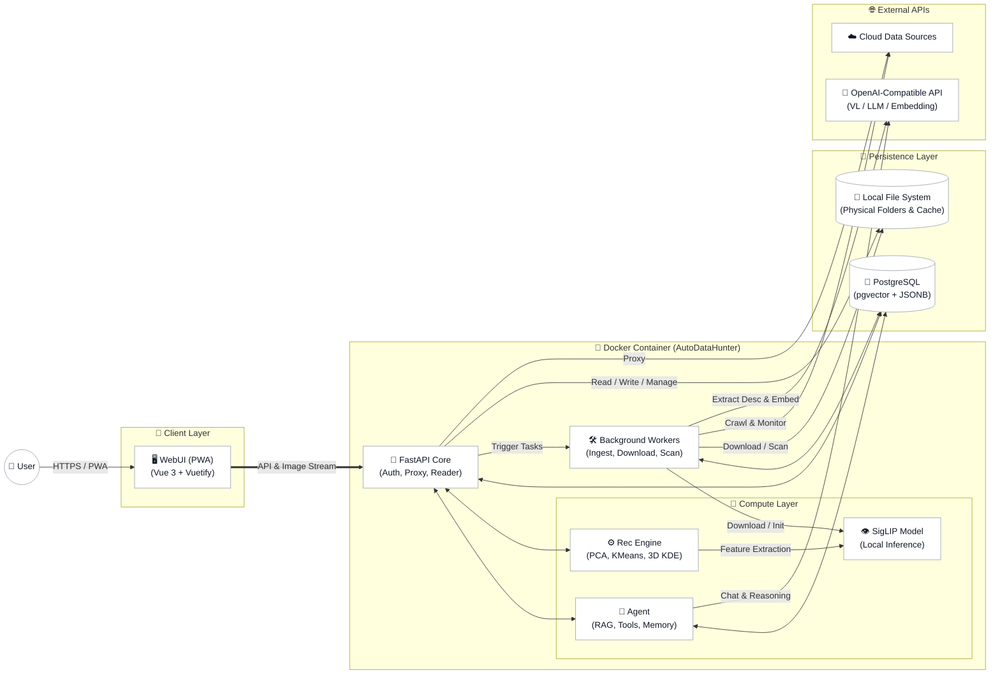

# AutoDataHunter (Multi-modal Digital Asset Manager)

## This is a demo repo, dose not contain all codes that mentioned below.

> **Disclaimer & Project Nature**
> This project (consisting of ~44,000 lines of code) is a personal endeavor built from scratch through deep collaboration with AI Coding Agents (Vibe-coding). It serves as an experimental sandbox to apply mathematical modeling and computational physics concepts (like thermodynamics and Boltzmann distributions) to real-world data science problems such as recommendation systems and hybrid search. While the algorithms here are experimental, this project demonstrates a strong willingness to cross-disciplinary boundaries, tackle complex system architectures (Vue3, FastAPI, Docker, pgvector), and continuously embrace cutting-edge AI paradigms.

## 📌 Introduction

AutoDataHunter is not just a media viewer; it is a privately hosted digital asset governance hub powered by **Multi-modal Computer Vision (SigLIP), Large Language Models (LLM), and Thermodynamic Recommendation Algorithms**. 
It bridges the entire pipeline from online data discovery and intelligent retrieval to user preference topology visualization and native file archiving. It aims to deconstruct and manage massive unstructured image and text assets using rigorous data science methodologies.

## ✨ Core Features

* **Omni-Channel Adaptability:** Responsive layout for mobile, tablet, and desktop, with PWA support for a native desktop-like immersive experience.
* **Multi-modal Hybrid Search:** Supports natural language intent search, native "image-to-image" search, fuzzy tag suggestions, and multi-dimensional filtering via Reciprocal Rank Fusion (RRF).
* **Native Folder Gallery:** Eliminates the "sandbox kidnapping" of ZIP/CBZ packing. Directly maps to local system directory structures for zero-I/O-overhead mapping.
* **Hardcore Preference Analytics:** Automatically generates 3D preference topology maps (KDE Potential Surfaces) and clustering analysis reports based on viewing duration and scoring behaviors.
* **Seamless Cloud-Local Superposition:** Supports real-time fetching from external data sources for online retrieval. High-value assets can be seamlessly archived to the local environment with one click.
* **Built-in AI Agent:** Provides natural language Q&A, exploratory discovery, and precise matching against the local asset library.
* **Enterprise-Grade Security Baseline:** Zero-trust design. Sensitive credentials are encrypted with dynamic Salt and HKDF before database storage, requiring Sudo secondary privilege escalation for dangerous operations.

## 🏗️ System Architecture

The project adopts a containerized microservices architecture, featuring a FastAPI backend, Vue3 frontend, PostgreSQL (pgvector) database, and independent background workers.



## 📊 Codebase Stats & Full Directory Structure

The system is highly decoupled and consists of approximately **44,000 lines of code**.

```text
=== Combined Lines of Code ===
Language         Files       Code    Comment    Blank      Total
-----------------------------------------------------------------
Python              71      19420        159     2621      22200
Vue                 41      12084         27      933      13044
JavaScript          26       6434         21      633       7088
JSON                 2       1684          0        0       1684
CSS                  1        502          1       88        591
-----------------------------------------------------------------
TOTAL              141      40124        208     4275      44607
```

<details>
<summary><b>Click to Expand Full Directory Tree</b></summary>

```text
=== Backend Tree (Docker/main/webapi) ===
AutoDataHunter/Docker/main/webapi
|-- core/
|   |-- __init__.py
|   |-- config_values.py
|   |-- constants.py
|   |-- middleware.py
|   |-- runtime_state.py
|   `-- schemas.py
|-- routers/
|   |-- __init__.py
|   |-- auth.py
|   |-- chat.py
|   |-- downloads.py
|   |-- external_live.py
|   |-- external_parser.py
|   |-- local_lib.py
|   |-- media.py
|   |-- reader.py
|   |-- recommend.py
|   |-- search.py
|   |-- settings.py
|   |-- system.py
|   `-- tasks.py
|-- services/
|   |-- __init__.py
|   |-- ai_provider.py
|   |-- auth_service.py
|   |-- chat_memory_service.py
|   |-- chat_service.py
|   |-- chat_session_service.py
|   |-- chat_stream_service.py
|   |-- config_service.py
|   |-- db_service.py
|   |-- dev_schema.py
|   |-- external_cover_embedding_service.py
|   |-- external_image_loader.py
|   |-- external_live_service.py
|   |-- external_metadata_service.py
|   |-- embed_service.py
|   |-- local_lib_service.py
|   |-- local_migration_service.py
|   |-- rec_service.py
|   |-- rec_service_local.py
|   |-- recommend_feedback_service.py
|   |-- recommend_profile_service.py
|   |-- schedule_service.py
|   |-- search_service.py
|   |-- setup_service.py
|   `-- vision_service.py
|-- static/
|   `-- assets/
|-- __init__.py
`-- main.py

=== Frontend Tree (Docker/main/webapp/src) ===
AutoDataHunter/Docker/main/webapp/src
|-- components/
|   |-- dashboard/
|   |   |-- PreviewCard.vue
|   |   `-- TagExploreOverlay.vue
|   |-- reader/
|   |   |-- ReaderLongPressSearch.vue
|   |   |-- ReaderNavWheel.vue
|   |   |-- ReaderQuickSettings.vue
|   |   `-- ReaderTopBar.vue
|   |-- AuthGate.vue
|   |-- MetricCard.vue
|   |-- ServiceChip.vue
|   `-- SetupWizard.vue
|-- composables/
|   |-- auditModule.js
|   |-- chatActions.js
|   |-- chatState.js
|   |-- controlModule.js
|   |-- dashboardActions.js
|   |-- dashboardHelpers.js
|   |-- dashboardState.js
|   |-- useContinuousScroll.js
|   |-- useThemeManager.js
|   |-- useViewportFit.js
|   `-- xpModule.js
|-- i18n/
|   |-- en.json
|   |-- index.js
|   `-- zh.json
|-- ico/
|-- layouts/
|   |-- AppSidebar.vue
|   |-- AppTopBar.vue
|   |-- ChatFabPanel.vue
|   `-- MainLayout.vue
|-- router/
|   `-- index.js
|-- stores/
|   |-- appStore.js
|   |-- auditStore.js
|   |-- chatStore.js
|   |-- controlStore.js
|   |-- dashboardStore.js
|   |-- layoutStore.js
|   |-- moduleStoreFactory.js
|   |-- settingsStore.js
|   |-- useToastStore.js
|   `-- xpStore.js
|-- styles/
|   `-- app.css
|-- utils/
|   `-- helpers.js
|-- views/
|   |-- settings/
|   |   |-- DataCleanSettingsPage.vue
|   |   |-- DeveloperSettingsPage.vue
|   |   |-- ExternalSettingsPage.vue
|   |   |-- GeneralSettingsPage.vue
|   |   |-- LlmSettingsPage.vue
|   |   |-- LocalLibSettingsPage.vue
|   |   |-- OtherSettingsPage.vue
|   |   |-- PluginsSettingsPage.vue
|   |   |-- ReaderSettingsPage.vue
|   |   |-- RecommendSettingsPage.vue
|   |   `-- SearchSettingsPage.vue
|   |-- tools/
|   |   |-- FileManagerPage.vue
|   |   `-- MetadataEditorPage.vue
|   |-- AuditPage.vue
|   |-- AuthPage.vue
|   |-- ChatPage.vue
|   |-- ControlPage.vue
|   |-- DashboardPage.vue
|   |-- DashboardScopePage.vue
|   |-- DownloadsPage.vue
|   |-- ExternalDashboardPage.vue
|   |-- LocalDashboardPage.vue
|   |-- ReaderPage.vue
|   |-- SettingsPage.vue
|   |-- ToolsPage.vue
|   `-- XpPage.vue
|-- api.js
|-- App.vue
`-- main.js

=== Scattered Python Tree (Background Workers) ===
AutoDataHunter/Docker/main
|-- externalCrawler/
|   `-- fetch_new_external_urls.py
|-- hunterAgent/
|   |-- core/
|   |   |-- __init__.py
|   |   |-- ai.py
|   |   |-- config.py
|   |   `-- db.py
|   |-- skills/
|   |   |-- builtin/
|   |   |-- __init__.py
|   |   |-- chat.py
|   |   |-- loader.py
|   |   |-- profile.py
|   |   |-- recommendation.py
|   |   |-- registry.py
|   |   |-- report.py
|   |   `-- search.py
|   |-- __init__.py
|   `-- main.py
|-- dataFlush/
|-- textIngest/
|   `-- ingest_jsonl_to_postgres.py
|-- vectorIngest/
|   |-- ingest_external_metadata_to_pg.py
|   `-- worker_vl_ingest.py
`-- webapp/
    `-- public/
```
</details>